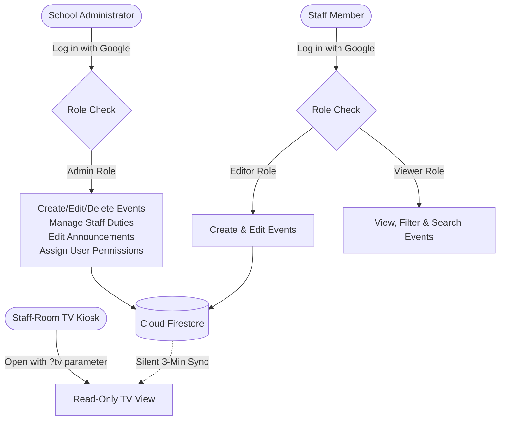

# Product and Usage Handover: School Calendar & Gantt Application (לוח שנה וגאנט בית ספרי)

**Target Audience for this Document:** OpenAI Codex / Incoming Development Team  
**Author:** Antigravity  
**Repository:** `https://github.com/nros1978-png/school-calendar`  
**Live Application:** `https://nros1978-png.github.io/school-calendar/`  
**Date:** October 2026  
**Companion Technical Document:** [`HANDOVER.md`](file:///C:/Users/נעם/.gemini/antigravity/scratch/school-calendar-gantt/HANDOVER.md)

---

## Epistemic Legend & Status Labels
To prevent assumptions from being mistaken for established facts, every insight and section in this handover is labeled with one of four tags:
- `[Owner Intent]`: Explicit requirement, correction, preference, or goal stated directly by the project owner in project history.
- `[Verified Behavior]`: Empirical functionality verified through current codebase analysis, UI tests, or data schema inspection.
- `[Agent Inference]`: Deductions drawn by Antigravity during implementation to connect user requirements with technical design.
- `[Unknown]`: Gaps, missing school-level context, or edge-case policies that only the owner can clarify.

---

## 1. Purpose and School Context

### Practical Problems Solved
- `[Owner Intent]`: **School-Wide Pedagogical Visibility:** Israeli state-religious schools manage complex, fast-moving pedagogical calendars featuring holidays, trips, exams, rosh chodesh events, and ceremonies. Traditional shared spreadsheets or generic calendars lack integrated Gantt visibility for multi-day pedagogical arcs and do not serve a dedicated physical display in the teachers' lounge.
- `[Owner Intent]` & `[Verified Behavior]`: **Staff-Room Information Hub:** Staff rooms have a wall-mounted TV that must show teachers what is happening today, who is on recess duty, urgent announcements, and the upcoming 3 weeks of school events at a single glance without anyone touching a keyboard or mouse.
- `[Owner Intent]` & `[Verified Behavior]`: **Daily Duty Roster Friction:** Managing rotating yard and gate supervision (`תורנויות`) across recess periods is error-prone. The app provides a central matrix where the school admin configures locations and assigns teachers per day-of-week, automatically projecting today's exact roster on the teachers' lounge screen every morning.

### Intended Audience & Organization
- `[Owner Intent]` & `[Verified Behavior]`: **Institution:** ממ"ד כרמי יהודה (State-Religious Elementary School named after Rabbi Yehuda Amital, located in Gush Etzion, Israel).
- `[Owner Intent]` & `[Verified Behavior]`: **Primary Owner / Admin:** School principal / pedagogical coordinator (`nros1978@gmail.com`).
- `[Verified Behavior]`: **Audiences:**
  1. *School Management / Admin:* Manages calendar events, annual duties, broadcasts announcements, and sets user role permissions.
  2. *Teaching Staff (Editors / Viewers):* Checks upcoming events, schedules grade-level activities, inspects recess duties, and filters by grade or category.
  3. *Staff-Room Casual Observers:* Staff members glancing at the wall-mounted Smart TV during breaks.

### What Successful Day-to-Day Operation Looks Like
- `[Agent Inference]`:
  - **Morning:** The staff-room TV turns on (or stays on), displaying the current date (Hebrew + Gregorian), today's recess duties clearly on the side panel, school announcements, and the current week's schedule.
  - **Mid-Day:** An administrator or grade coordinator enters a new trip or adjusts an announcement from their laptop; within 3 minutes, the staff-room TV updates silently without reloading the browser window or causing visual flicker.
  - **Planning Periods:** Teachers open the Gantt or Month view on their personal laptops or mobile phones, filtering by their specific grade (e.g., כיתה ד) to check exam density before scheduling an event.

---

## 2. Users and Real Workflows



### 1. School Administrator Workflow
- `[Verified Behavior]`:
  - **Goal:** Full operational control over school calendar, staffing duties, communications, and access control.
  - **Steps Taken:**
    1. Opens web app and signs in via Google (`loginWithGoogle`).
    2. Receives `admin` role automatically (or via `users` collection lookup).
    3. Gains access to the top navigation action bar: **+ אירוע חדש** (New Event), **ניהול תורנויות** (Manage Duties), and **ניהול משתמשים** (User Management).
    4. **Updating Duties:** Opens the duty modal, defines locations (e.g., `שער ראשי`, `חצר עליונה`), edits the weekly assignment matrix (Sunday–Friday) for each recess (`הפסקה ראשונה`, `הפסקה שנייה`), and saves to Firestore.
    5. **Announcements:** Edits the persistent staff announcement text directly on the screen or in modal.
    6. **Permissions:** Opens user management dialog, views list of users who have signed in, and toggles their access between `viewer`, `editor`, and `admin`.

### 2. Staff Member (Editor) Workflow
- `[Verified Behavior]`:
  - **Goal:** Add and maintain pedagogical events for their classes or subjects without altering school-wide settings or duties.
  - **Steps Taken:**
    1. Signs in with Google account.
    2. Role resolves to `editor`.
    3. Clicks **+ אירוע חדש** or clicks directly on a calendar day.
    4. Enters event title, selects category (e.g., טיול, מבחן, אירוע בית ספרי), picks start and end dates, checks target grades (א, ב, ג...), and clicks Save.
    5. Can edit or delete existing events they created or have access to. Cannot access User Management or Duty Management.

### 3. Staff Member (Viewer) Workflow
- `[Verified Behavior]`:
  - **Goal:** Consult the schedule, track school timelines, check testing schedules.
  - **Steps Taken:**
    1. Browses the application as an unauthenticated guest or authenticated `viewer`.
    2. Toggles between **לוח חודשי** (Calendar), **גאנט** (Gantt), and **תצוגת טלוויזיה** (TV).
    3. Uses the Grade filter dropdown (e.g., selects `שכבה ה`) or Category filter to isolate relevant events.
    4. Uses the search bar to find specific teachers, subjects, or keywords.
    5. Clicks an event chip to open a detailed modal showing exact dates, grade levels, and description.

### 4. Staff-Room Television (Kiosk) Viewing
- `[Owner Intent]` & `[Verified Behavior]`:
  - **Goal:** Completely hands-free, passive consumption of today's immediate priorities and the upcoming 4-week horizon.
  - **Steps Taken:**
    1. Kiosk TV browser boots directly to `https://nros1978-png.github.io/school-calendar/?tv`.
    2. App recognizes kiosk mode: suppresses all edit buttons, suppresses login UI, hides navigation controls, and enters fullscreen layout.
    3. Displays 4 weeks (current week + 3 weeks ahead), Sunday through Friday.
    4. Right panel highlights **תורני היום** (Today's Duties) broken down by recess and location, plus **הודעות לצוות** (Announcements).
    5. Every 3 minutes, silently queries Firestore in background; if new events or duty updates occurred, DOM updates smoothly without page refresh or white flash.

---

## 3. The Purpose of Each View

| View | Target User | Practical Questions Answered | Key Visual Features |
| :--- | :--- | :--- | :--- |
| **לוח חודשי (Month Calendar)** | All Staff, Admin | *"What is happening this week?"*<br/>*"Is next Tuesday Rosh Chodesh?"*<br/>*"What special days are coming up?"* | Traditional monthly grid; toggle between Hebrew month mode (תשרי, חשוון) and Gregorian month mode; holiday markers; day click opens new event. |
| **תרשים גאנט (Gantt Chart)** | Coordinators, Principals | *"How do our multi-day projects and exam periods overlap?"*<br/>*"Are 6th graders overloaded during this two-week window?"* | Timeline bar layout; multi-day bars spanning date columns; wrapped titles without vertical distortion; filterable by grade and category. |
| **תצוגת טלוויזיה (TV Screen)** | Entire Staff in Lounge | *"Who is on gate duty during first break today?"*<br/>*"What urgent announcements are there?"*<br/>*"What does our schedule look like over the next 4 weeks?"* | Fixed 4-week rolling window; Saturday omitted; dedicated duty & announcement sidebar; auto-fit fonts; zero manual scrolling needed. |

### Practical Navigation & Interaction Features
- `[Owner Intent]` & `[Verified Behavior]`:
  - **Hebrew Month vs. Gregorian Month Toggle:** The owner explicitly requested Hebrew calendar primacy. The default view groups dates by Hebrew months (e.g. תשרי, מרחשוון). A toggle button allows switching to standard Gregorian calendar months (September, October) when coordinating external dates.
  - **Category & Grade Filters:** Instant in-memory multi-attribute filtering. Selecting grade `ג` hides all events not tagged for grade `ג` or tagged as all-school (`כלל ביה"ס`).
  - **Free-Text Search:** Filters visible events in real time by title and description.

---

## 4. Meaning of the Information

### Event Categories & Color Coding
`[Verified Behavior]` (Configured in `js/calendar.js` & `js/db.js`):
- 🟣 **אירוע בית ספרי (School Event)** (`#4f46e5` / Indigo): Whole-school events, assemblies, ceremonies, special visitors.
- 🟢 **טיול / סיור (Trip / Excursion)** (`#059669` / Emerald): Field trips, pedagogical nature walks, class outings. Multi-day trip bars render prominently in Gantt.
- 🔴 **מבחן / הערכה (Exam / Assessment)** (`#dc2626` / Red): Major exams, grading milestones, assessment periods.
- 🟡 **טקס / פעילות (Ceremony / Activity)** (`#d97706` / Amber): Memorials, holiday celebrations, grade performances.
- 🔵 **חופשה / מועד (Holiday / Special Day)** (`#2563eb` / Blue): Ministry of Education vacation days, national holidays, fast days.
- ⚪ **אחר (Other)** (`#64748b` / Slate): General pedagogical deadlines, staff meetings.

### Target Grades (`שכבות גיל`)
- `[Verified Behavior]`: Options include grades **א**, **ב**, **ג**, **ד**, **ה**, **ו**, and **כלל ביה"ס** (All School).
- Multi-selection is supported: a single event can be assigned to `א` and `ב` simultaneously.

### Single-Day vs. Multi-Day Events
- `[Verified Behavior]`:
  - **Single-Day:** Has `startDate == endDate`. Appears as a discrete badge in the day cell.
  - **Multi-Day:** Has `startDate < endDate`. In the Month view, renders as a spanning bar or repeated badge across the date range. In the Gantt view, renders as a horizontal progress/timeline bar spanning the full date range.

### Holidays and Special Days (`חגים וימי חופש`)
- `[Owner Intent]` & `[Verified Behavior]`:
  - Israeli Jewish holidays and Ministry of Education vacations are built-in (Rosh Hashana, Yom Kippur, Sukkot, Chanukah, Purim, Pesach, Shavuot, etc.).
  - Rosh Chodesh (`ראש חודש`) is computed automatically from the Hebrew calendar engine.
  - **Special Addition (Owner Requested):** Municipal / National Election Day (**27.10.2026 / 27.10**) is explicitly hardcoded and flagged as an official vacation day (`יום הבחירות - יום שבתון`).

### Duty Rosters (`תורנויות צוות`)
- `[Owner Intent]` & `[Verified Behavior]`:
  - **Hierarchy:** School Locations (`מקומות`) $\rightarrow$ Recess Breaks (`הפסקות`) $\rightarrow$ Days of Week (Sunday–Friday).
  - **Dynamic Projection:** Duties are stored as a weekly recurring template. The application determines the current day of the week (e.g. Tuesday) and automatically looks up the corresponding roster for today.
  - **Clean Empty State:** The owner insisted that dummy/sample duty data must never be shown. If no roster has been configured by the admin, the TV display renders a clean notice rather than mock data.

### Staff Announcements (`הודעות לצוות`)
- `[Owner Intent]` & `[Verified Behavior]`:
  - Persistent bulletin text stored in Firestore (`appConfig/general`).
  - Displays directly below today's duties on the TV screen. Used for urgent reminders (e.g. staff meeting location change, dress code for tomorrow).

---

## 5. Television Display as a Product

```
+---------------------------------------------------------------------------------------------------------+
| [LOGO ONLY]                תשרי - חשוון תשפ"ז | Oct-Nov 2026                 [ 08:42:15 ] [יום שלישי כ"ה תשרי] |
+-----------------------------------------------------------------------------------+---------------------+
|                              4-WEEK ROLLING GRID                                  |   TODAY'S SIDEBAR   |
|                                                                                   |                     |
|  [ראשון Sun]  [שני Mon]  [שלישי Tue]  [רביעי Wed]  [חמישי Thu]  [שישי Fri]  (NO שבת)  |  +---------------+  |
| +----------+----------+-----------+-----------+----------+---------+              |  | תורני היום    |  |
| | Week 1   |          | TODAY     |           |          |         |              |  | (Duties)      |  |
| +----------+----------+-----------+-----------+----------+---------+              |  | שער: משה      |  |
| | Week 2   |          |           |           |          |         |              |  | חצר: שרה      |  |
| +----------+----------+-----------+-----------+----------+---------+              |  +---------------+  |
| | Week 3   |          |           |           |          |         |              |  | הודעות לצוות   |  |
| +----------+----------+-----------+-----------+----------+---------+              |  | (Announcements)|  |
| | Week 4   |          |           |           |          |         |              |  | Max 20% height|  |
| +----------+----------+-----------+-----------+----------+---------+              |  +---------------+  |
+-----------------------------------------------------------------------------------+---------------------+
|                  [Background silent in-memory refresh running every 3 minutes]                          |
+---------------------------------------------------------------------------------------------------------+
```

### Purpose & Environment
- `[Owner Intent]`: Wall-mounted Smart TV screen located in the teachers' staff room (`חדר מורים`).
- `[Owner Intent]`: Viewed from several meters away by teachers during noisy, short recess periods.
- `[Owner Intent]`: Everything must be legible at a glance without interaction.

### Why 4 Rolling Weeks (Current + 3 Ahead)?
- `[Owner Intent]`: Teachers need immediate context for the current week, but school scheduling requires visibility into upcoming deadlines, exams, and holidays over the next month. Showing past weeks is useless on a kiosk screen.
- `[Owner Intent]`: The grid always anchors Week 1 to the current week containing "Today", followed by Week 2, Week 3, and Week 4.

### Why Saturday (שבת) is Excluded
- `[Owner Intent]`: ממ"ד כרמי יהודה is an elementary school operating Sunday through Friday. No pedagogical events or duties occur on Shabbat.
- `[Owner Intent]`: Removing the 7th column frees up roughly 14% more horizontal width for each of the 6 working days, which directly prevents text clipping on small TV cards.

### Readability, Crowding & Dynamic Font Sizing
- `[Owner Intent]` & `[Verified Behavior]`:
  - **Text Wrapping:** Event titles must never be clipped with `text-overflow: ellipsis`. Titles wrap onto multiple lines (`white-space: normal`, `word-break: break-word`).
  - **Crowded Days:** If a single day contains multiple events, the font size automatically scales down (from standard `0.8rem` down to `0.55rem`) to fit within the viewport without triggering scrollbars.
  - **Announcements Box Proportion:** The owner found that announcements previously dominated the sidebar. It is now constrained to a maximum of 20% of the panel height (minimum 60px) so that Today's Duties remain the primary focus.

### Header Simplification & Kiosk Controls
- `[Owner Intent]` & `[Verified Behavior]`:
  - **No Verbose Text:** The owner requested removing the lengthy title text ("ממ"ד כרמי יהודה וכו'")—the school logo alone is sufficient.
  - **No Exit Button:** The "חזרה לתצוגה רגילה" (Back to normal view) button was explicitly removed in TV mode because it is a physical TV where users cannot click, and it was visual clutter.
  - **Live Clock:** A digital clock ticks every second with seconds display (`HH:MM:SS`) alongside the dual Hebrew and Gregorian dates.

### Background Refresh (Every 3 Minutes)
- `[Owner Intent]` & `[Verified Behavior]`:
  - `setInterval` triggers `DB.refreshFromRemote()` every 180,000 ms (3 minutes).
  - Fetches the latest Firestore state in memory and re-renders DOM in place.
  - **Zero Visual Blink:** Does not trigger `window.location.reload()`, preserving seamless kiosk appearance.

---

## 6. Owner Preferences and Design Decisions

| Historical Owner Request | Practical Problem Addressed | Current Application Implementation | Acceptance Status |
| :--- | :--- | :--- | :--- |
| **"תצוגת לוח שנה לפי חודשים עבריים"** (Hebrew month default) | The school operates according to the Jewish calendar cycle (תשרי, מרחשוון). Gregorian months broke holiday alignment. | Built custom Hebrew calendar grouping engine; defaults to Hebrew month with toggle to Gregorian. | `[Owner Intent]` **Accepted** |
| **"בגאנט, שהשורות לא יימתחו ויהיו שוות, והטקסט יירד שורה"** | Multi-day Gantt bars were stretching unevenly or truncating text. | Implemented uniform row height with wrapped title text inside Gantt event bars. | `[Owner Intent]` **Accepted** |
| **"תצוגת טלוויזיה: לא צריך לראות שבת"** | Saturday took up screen real estate in a school operating Sunday–Friday. | TV grid renders exactly 6 columns (ראשון to שישי), expanding column widths. | `[Owner Intent]` **Accepted** |
| **"הודעות לוקחות יותר מדיי מקום. תצמצם בחצי"** | Announcements box occupied half the right-hand sidebar, pushing duties off-screen. | Set max-height on announcements container to 20% with internal auto-scroll only if excessively long; duties take 80%. | `[Owner Intent]` **Accepted** |
| **"אין צורך בלחצן 'חזרה לתצוגה רגילה'"** | Unnecessary interactive button on a passive TV display. | Completely removed the exit button from TV layout. | `[Owner Intent]` **Accepted** |
| **"הכתב נחתך... יירד שורה... תקטין כמה שאפשר את הגופן"** | Small event boxes cut off multi-word event titles on TV. | Added `white-space: normal`, line wrapping, and dynamic font reduction algorithm based on event count per cell. | `[Owner Intent]` **Accepted** |
| **"מספיק רק הלוגו, לא צריך ממ"ד כרמי יהודה וכו'"** | Cluttered top header on TV view. | Replaced text title with clean school logo and clean month name ("תשרי - חשוון"). | `[Owner Intent]` **Accepted** |
| **"ריענון כל 3 דקות בלי שייראו את הריענון עצמו"** | Full-page reload flashed white screen on the staff room TV every few minutes. | Implemented silent in-memory Firestore refresh via `DB.refreshFromRemote()` timer. | `[Owner Intent]` **Accepted** |
| **"תוסיף את תאריך 27.10, יום הבחירות כיום חופש"** | Municipal/National elections are vacation days not present in standard Jewish calendar algorithms. | Added fixed election day holiday rule for October 27th. | `[Owner Intent]` **Accepted** |
| **"שלא יהיו נתוני דמה בתורנויות"** | Initial implementation showed placeholder teachers ("משה", "שרה"), causing confusion among actual staff. | Duty data now initializes empty; if not configured, shows placeholder prompt to configure rather than fake names. | `[Owner Intent]` **Accepted** |

---

## 7. Current Limitations and Unfinished Ideas

### Confirmed Incomplete Areas & Gaps
1. `[Verified Behavior]`: **Client-Side Permission Enforcement Only:**  
   Firebase Firestore rules currently allow public read/write (`allow read, write: if true;`) to avoid deployment roadblocks during initial prototyping. Roles (`admin`, `editor`, `viewer`) are enforced purely in JavaScript. Anyone with the Firebase project config could technically modify data directly.
2. `[Verified Behavior]`: **Duty Schedule is Weekly Static, Not Date-Specific:**  
   The duty roster is a recurring weekly template (Sunday–Friday). If a specific teacher is sick on a specific Tuesday or takes maternity leave, there is no one-off substitute assignment mechanism without editing the permanent weekly template.
3. `[Verified Behavior]`: **TV Mode Screen Wake Lock Dependency:**  
   While the browser runs smoothly, some older Android TV browser builds go into screen-saver mode after 20 minutes if no user interaction occurs. The application does not currently call the HTML5 Screen Wake Lock API (`navigator.wakeLock.request('screen')`).
4. `[Verified Behavior]`: **Mobile Responsive Touch Gestures:**  
   On mobile phones, viewing the Gantt chart requires horizontal scrolling. There are no swipe gestures for month navigation (must click chevron buttons).

### Suggestions / Potential Improvements (Not Explicitly Requested)
- `[Agent Inference]`:
  - Enforce role-based security rules on Firestore via Firebase Custom Claims.
  - Implement Screen Wake Lock API to prevent smart TV screens from dimming.
  - Add export to Google Calendar / iCal for individual teachers.

---

## 8. Concrete Usage Examples

*(Names and events below are illustrative and fictional, grounded in actual application logic)*

### Example 1: Creating an All-School Ceremony
- **User:** Principal (Admin)
- **Goal:** Add the annual Rabin Memorial Ceremony (`טקס יום הזיכרון ליצחק רבין`).
- **Steps in App:**
  1. Clicks **+ אירוע חדש** in header.
  2. Enters Title: `טקס יום הזיכרון ליצחק רבין`.
  3. Selects Category: `טקס / פעילות` (Amber badge).
  4. Sets Start Date: `2026-11-02` (single day).
  5. Selects Target Grades: Checks `כלל ביה"ס`.
  6. Enters Description: `טקס בהובלת כיתות ו' באולם הספורט, שעה 10:00`.
  7. Clicks **שמור אירוע**.
- **Result:** Event appears immediately in Month View, Gantt View, and on the Staff-Room TV during that week.

### Example 2: Planning a 3-Day Grade Trip in the Gantt View
- **User:** Grade 6 Coordinator (Editor)
- **Goal:** Schedule the 3-day desert excursion (`מסע שלח כיתות ו' מדבר יהודה`).
- **Steps in App:**
  1. Switches view to **תרשים גאנט**.
  2. Clicks **+ אירוע חדש**.
  3. Enters Title: `מסע של"ח כיתות ו'`.
  4. Selects Category: `טיול / סיור` (Emerald badge).
  5. Sets Start Date: `2026-11-15`, End Date: `2026-11-17`.
  6. Selects Target Grades: `ו`.
  7. Clicks **שמור**.
- **Result:** A continuous green bar spans across November 15, 16, and 17 on the Grade 6 row in Gantt. In TV view, badges appear on each of the three days with the title cleanly wrapped.

### Example 3: Updating the Weekly Recess Duty Roster
- **User:** Vice Principal (Admin)
- **Goal:** Assign staff for Sunday duties at the Main Gate and Upper Yard.
- **Steps in App:**
  1. Clicks **ניהול תורנויות**.
  2. In the duty matrix, selects day tab **יום ראשון**.
  3. Under `הפסקה ראשונה (10:00 - 10:30)`:
     - Sets `שער ראשי`: `הרב אליהו`
     - Sets `חצר עליונה`: `רחל כהן`
  4. Under `הפסקה שנייה (12:00 - 12:20)`:
     - Sets `שער ראשי`: `יוסי לוי`
     - Sets `חצר עליונה`: `מיכל אברהם`
  5. Clicks **שמור שינויים**.
- **Result:** Changes persist to Firestore (`duties/weeklySchedule`). On Sunday morning, the TV sidebar automatically displays these four teachers under "תורני היום".

---

## 9. Questions Only the Owner Can Answer

The incoming Codex developer should clarify the following prioritized items directly with the school administrator:

1. **Firestore Security Hardening:**  
   *Current state:* Firestore rules currently allow public write access.  
   *Question for Owner:* Would you like Codex to enforce strict role-based Firestore rules (restricting writes exclusively to verified Google emails in the `users` collection), or keep rules open during your testing phase?
2. **Duty Rosters for Irregular Schedule Days / Substitutions:**  
   *Current state:* Duties are a recurring Sunday–Friday template.  
   *Question for Owner:* Do you need a way to log temporary one-day teacher substitutions (e.g. for sick leave), or is the permanent weekly template sufficient?
3. **Smart TV Power & Hardware Model:**  
   *Current state:* TV browser refreshes every 3 minutes silently.  
   *Question for Owner:* Does the staff-room television stay on 24/7 or use an automatic timer/Android TV power schedule? Does the browser ever sleep or dim during the day?
4. **Historical Event Archiving:**  
   *Current state:* All events remain in Firestore indefinitely.  
   *Question for Owner:* At the end of the school year (תשפ"ז), should past events be archived into an annual backup, or kept accessible across years?

---
*End of Product Handover Document. Refer to [`HANDOVER.md`](file:///C:/Users/נעם/.gemini/antigravity/scratch/school-calendar-gantt/HANDOVER.md) for technical architecture, file map, Firebase schema, and GitHub Pages deployment instructions.*
